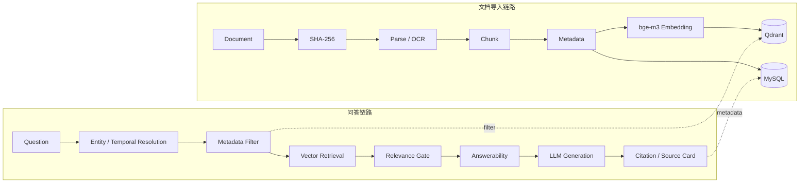

# NJU Compass

> 基于 Spring Boot + RAG 的校园知识检索与可信问答平台

**南大校园知识助手**最初从南京大学转专业资料问答场景出发，随后扩展到培养方案、转专业政策、专业分流、学院指南、课程信息、学习经验、面试与机试经验，以及其他校园学习资料。

NJU Compass 是一个 RAG（Retrieval-Augmented Generation）项目，而不是 Agent。系统先检索已收录资料，再基于证据生成带来源的回答。

> 本项目是非官方校园知识检索工具，不能替代南京大学或相关院系发布的最新官方通知。

## 核心能力

- 导入 PDF、DOCX、Markdown、TXT 文档。
- 使用 PDFBox、Apache Tika 解析文档，并提供 Tesseract OCR fallback。
- 通过 SHA-256 实现文件级幂等导入，避免重复创建文档。
- 在 MySQL 中保存 Document、Chunk 及结构化元数据。
- 使用 Ollama 与 `bge-m3` 生成 Embedding，在 Qdrant 中执行向量检索。
- 通过 Entity Resolution 解析学院、专业、大类、方向与简称，并形成 canonical department/major。
- 使用 `TARGET`、`EXCLUDED` 等实体角色区分查询目标和排除项。
- 区分 `policyYear`、`cohortYear` 与 `effectiveYear`，处理政策发布周期和适用年级。
- 使用 `StructuredPolicyChunker` 和 `CohortAwareTextChunker` 降低跨行、跨 cohort 的 Chunk 混合。
- 结合实体、年份、资料范围和来源类型执行 Metadata Filtering。
- 通过 Answerability Gate 进行 fail-closed 证据充分性判断。
- 在回答中保留 Citation，并通过 Source Card 展示官方/经验资料、元数据和原始资料入口。
- 提供 MySQL、Chunk 与 Qdrant payload 的 metadata consistency check。
- 使用固定 Ground Truth、Regression 与 Failure Attribution 进行离线评测。

## 技术栈

| 层次 | 技术 |
|---|---|
| 后端 | Java 21、Spring Boot、Spring AI |
| 数据与检索 | MySQL、Qdrant |
| AI | Ollama、`bge-m3`、DeepSeek-compatible Chat API |
| 用户端 | Vue、Vite |
| 管理端 | Vue、Vite |
| 评测 | 固定 Ground Truth、Regression、Failure Attribution |

## 系统架构



## 关键工程设计

### MySQL 与 Qdrant 的职责分离

MySQL 保存可管理、可审计的文档与 Chunk 记录；Qdrant 保存向量和检索 payload。两者分别承担业务事实源与高效语义检索职责。

### Metadata consistency

同一 Chunk 在 MySQL 和 Qdrant 中需要具有一致的 department、major、year、scope 等字段。一致性检查用于定位缺失字段、旧索引 payload 和一对多 Point 等问题，避免正确资料因过滤条件不一致而不可见。

### policyYear 与 cohortYear

`policyYear` 表示政策或 transfer cycle，`cohortYear` 表示规则适用的学生年级；两者不能互相替代。`effectiveYear` 用于形成检索侧统一的时间语义。拆分这些字段可以避免同一政策表中不同 cohort 规则相互污染。

### Entity Resolution

简称、专业、大类和学院不是简单的一对一字符串替换。系统通过 canonical entity、实体角色、major-to-department 映射和最长匹配等机制生成稳定的查询目标，再用于 metadata filter。

### Fail-closed Answerability

当检索证据不足、引用无效或 checker 无法可靠判断时，系统选择拒答，而不是用模型常识补全事实。最终冻结版本使用经过完整回归的 Answerability V1；4B/4C 的实验架构未进入生产版本。

### 固定回归集

固定 Ground Truth 能把 Retrieval、Metadata、Year/Cohort、Answerability 与 Generation 的问题分开归因，也能在每轮改动后检查历史 PASS 是否回归。

## Evaluation

| 版本 | PASS | Pass Rate | 相对 Baseline |
|---|---:|---:|---:|
| Baseline | 36 / 82 | 43.90% | — |
| Internship Freeze | 51 / 82 | 62.20% | +15 PASS / +18.30 percentage points |

最终固定 82 题回归中：

- `WRONG = 0`
- `YEAR_MISMATCH = 0`
- `HALLUCINATION = 0`
- `SYSTEM_ERROR = 0`

一次 Full Regression 中，`TRAG-066` 曾出现 `WRONG_SOURCE`：相邻的二次拔尖场景被混入转专业面试回答。随后三次独立复核均未再次出现 `WRONG_SOURCE`，该案例被记录为 nondeterministic source-selection outlier，而不是声明系统永远不会发生来源选择错误。

详细报告见 [`evaluation/`](evaluation/README.md)。

## Evaluation-driven Iteration

```text
Baseline 36/82
  → Metadata Consistency 2A
  → Entity Resolution 2B
  → Policy Year / Cohort 3A
  → Historical Cohort 3B
  → Full Regression 51/82
  → INTERNSHIP_FREEZE
```

Answerability 相关工作遵循“诊断—实验—回归—恢复”的流程：

- 4A：只读诊断与稳定性分析。
- 4B：确定性聚合实验，未通过最终验收。
- 4C：语义边界实验，未通过最终验收。
- 最终生产版本：恢复并保留经过完整回归的 Answerability V1。

4B/4C 的失败结果作为工程决策依据保留，但没有进入最终生产实现。

## Known Limitations

- Answerability 在固定证据下仍可能发生 false refusal。
- Evidence Window / TopK 可能遗漏同文档其他 Chunk 的关键事实。
- Generation 可能遗漏列表项或组合问题中的部分事实。
- Source Authority 和相邻 scenario boundary 仍存在长尾问题。
- 未显式给出 cohort 时，部分规则可能需要用户补充年级。
- Entity Resolution 对少见简称、多学院大类和历史名称仍需维护。
- 知识库未收录的资料无法由系统可靠回答。
- LLM 具有非确定性，单次运行不能代表稳定语义结果。

当前系统适合作为带引用的校园知识检索与问答作品展示，不应被描述为生产级、完全准确、权威问答或官方助手。

## Repository Structure

```text
src/main/            Spring Boot 生产代码
src/test/            后端测试
transfer-rag-web/    NJU Compass 用户端
transfer-rag-admin/  知识库管理端
evaluation/          固定评测集、实验记录与冻结报告
```

## Local Development

### 1. 环境准备

- Java 21
- MySQL
- Qdrant
- Ollama，并准备 `bge-m3`
- Node.js 与 npm
- 可选：Tesseract OCR

### 2. 本地配置

敏感配置应写入被 Git 忽略的本地配置文件或环境变量，不要提交真实凭据。配置时使用安全占位符，例如：

```text
API key: YOUR_API_KEY
Database URL: YOUR_DATABASE_URL
Qdrant URL: YOUR_QDRANT_URL
Database password: YOUR_DATABASE_PASSWORD
```

### 3. 启动后端

```bash
./mvnw spring-boot:run
```

Windows 可使用：

```powershell
.\mvnw.cmd spring-boot:run
```

### 4. 启动用户端或管理端

进入对应前端目录后执行：

```bash
npm install
npm run dev
```

生产构建使用：

```bash
npm run build
```

## Disclaimer

本平台为非官方校园知识检索工具，回答基于已收录资料生成。涉及培养方案、转专业、课程安排等重要事项，请以南京大学及相关院系最新官方通知为准。
